# 大学方程式赛车后车身域控制器 RBCM

# 关于本项目

本人的国创项目，一款基于AUTOSAR+MBD开发的车规级大学方程式赛车后车身域控制器RBCM，具体功能如下：

1. 具备2.4G无线烧录与标定功能
2. 整车低压配电过流保护（取代保险丝）
3. 整车低压配电管理与诊断，可实时诊断各通道电流情况
4. 与整车CAN通信（PCAN、BCAN）
5. 集成4G数传功能，采集整车跑动数据，并在MQTT上位机端实时显示
6. 拥有丰富的外设挂载接口（多电平兼容），支持各种协议传感器等设备接入（包括ADC PWM UART IIC SPI，支持3.3V及5V）
7. 具备低压电池电压电流温度监测、保护与DCDC充电管理功能
8. 带主动防护，包括过流保护、反接保护、TVS保护、过压保护等

项目意义：优化大学方程式赛车整车电子电气架构，使VCU专注于底盘域的控制，RBCM负责车身域的管理与诊断

为什么叫后车身域控制器？RBCM的设计目标包括对低压电池的监测和对整车低压配电诊断管理，因此与低压电池布置在一起，而WUTE车队的低压电池主要布置在车身后舱，因此RBCM也布置也在后方。

本项目适用于[大学生方程式赛事](http://www.formulastudent.com.cn/)(👈戳我了解)，本项目是依照大学生方程式赛事规则进行设计的。

本项目针对[武汉理工大学WUTE车队](https://space.bilibili.com/1177337861?spm_id_from=333.337.0.0)(👈戳我了解)25赛季E03电动方程式赛车开发，包含后车身域控制器的硬件设计及MBD软件开发，以及QT数传上位机的设计与开发。

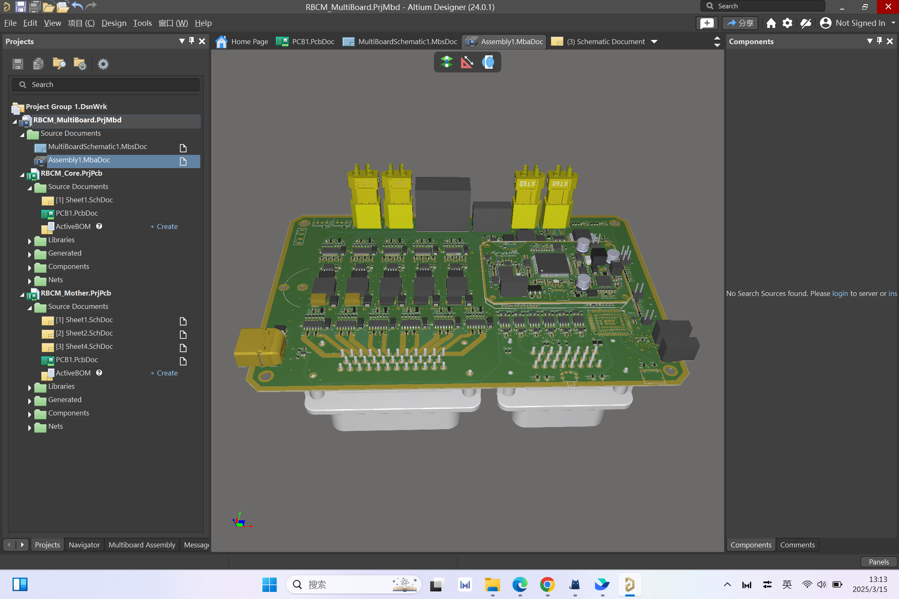

---

# 设计说明

## 硬件说明

硬件采用核心板和底板分板设计，板对板连接器连接

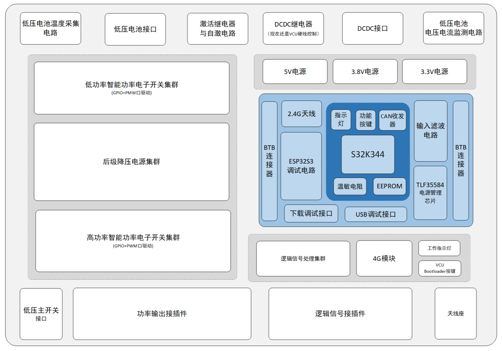

### RBCM核心板：

主控采用NXP的车规级微控制器S32K344，符合ASIL D的功能安全等级和ISO 26262标准

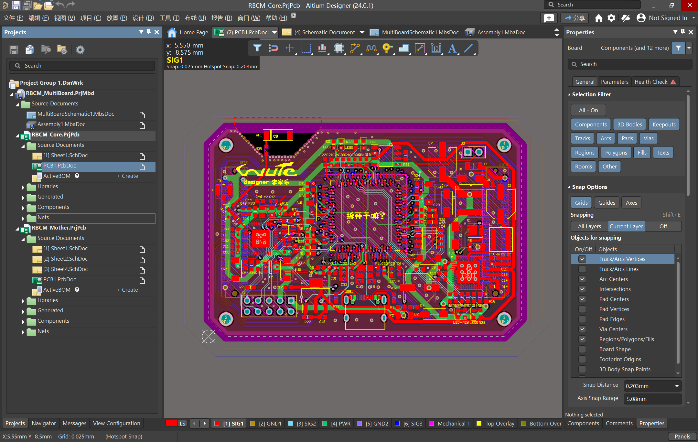

核心供电采用的是infineon的车规级电源管理芯片TLF35584，满足ASIL D的功能安全等级和ISO 26262标准

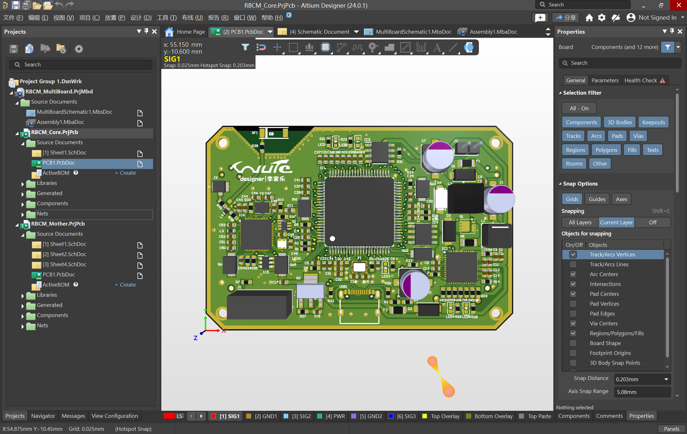

采用ESP32S3作为调试芯片，基于DAPlink调试方案，[DAPlink方案实现参考](https://oshwhub.com/ylj2000/dap_hs_esp_open)(👈戳我了解)，支持无线串口和2.4G无线调试与标定功能

### RBCM底板：

低压配电保护与诊断管理方面基于infineon的智能高边驱动芯片BTT6200-4ESA和BTT6050-2ERA实现

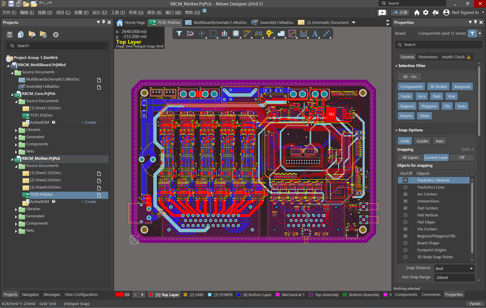

4G模块采用的是移远的EC800M模块，自弹式SIM卡设计

支持12V和24V低压平台，核心板供电支持范围为：5V-36V（经验证）

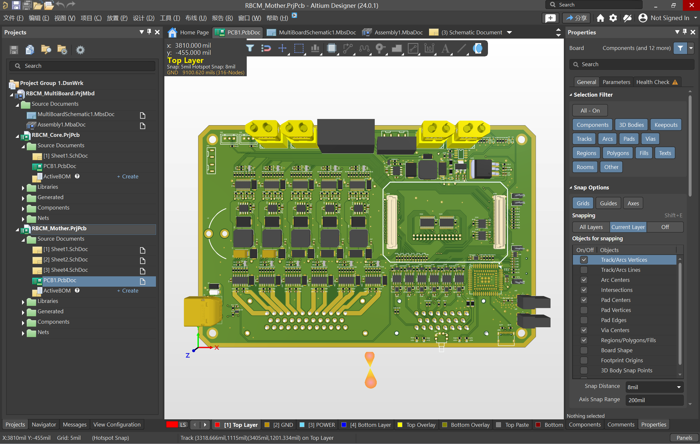

低压配电方面，理论上可支持最大 56A/1344W 的配电功率输出（24V低压平台下）

具备过压保护，浪涌保护，反接保护，过流保护，温度电流监测等防护功能

硬件BOM配单整理中...

## 软件说明

软件部分基于NXP的工具链开发，包括：

1. AUTOSAR MCAL层配置工具：S32 Config Tool
2. AUTOSAR应用层开发工具：MBD开发工具箱（基于simulink平台）：NXP_MBDToolbox_S32K3xx
3. 观测与标定工具：FreeMaster

采用自下而上的AUTOSAR SWC开发方式，先在simulink开发模型组件，再生成ARXML（AUTOSAR描述文件）组件描述并与simulink模型绑定

本项目MBD模型采用模块化的搭建方式，将软件功能划分为了几个子系统搭建

部分开发记录请见 ..\Firmware\AUTOSAR_MBD\RBCM_MBD\RBCM_Model.md 文件

MBD模型展示：

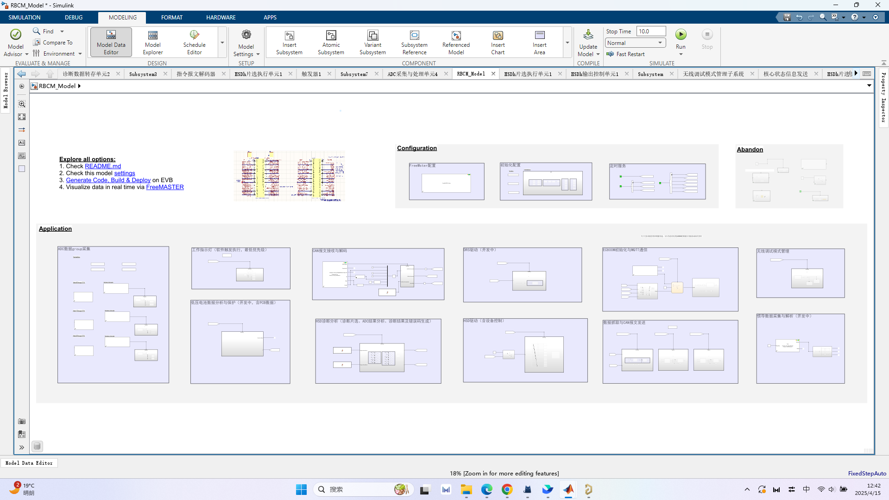

### 关于CAN应用层协议架构

CAN发送部分将报文分成了三组，分别负责MBCM核心数据、诊断数据、采集的传感器数据报文发送至CAN总线上

当前MCAL层已完成RBCM适配，MBD应用层开发已接近完成...

## 数传上位机说明

基于QT6.5的Qt Quick开发，详细介绍说明请见软件内的'关于本项目'

部分界面展示：

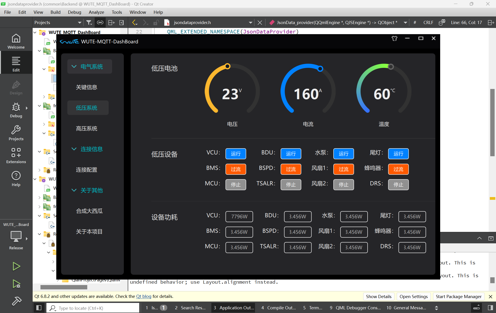

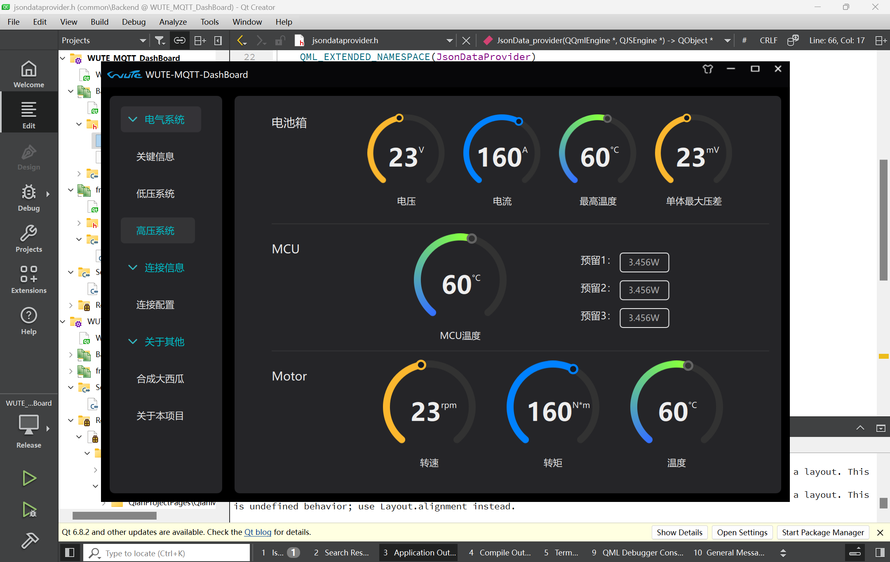

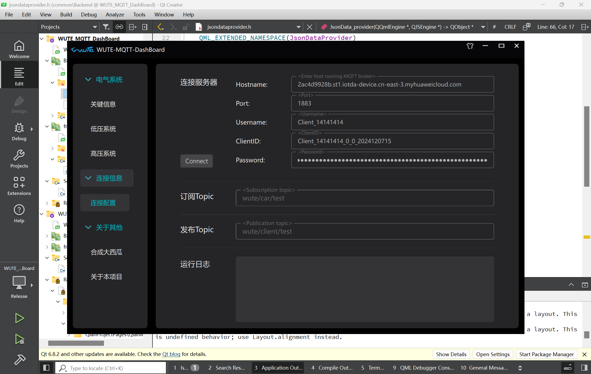

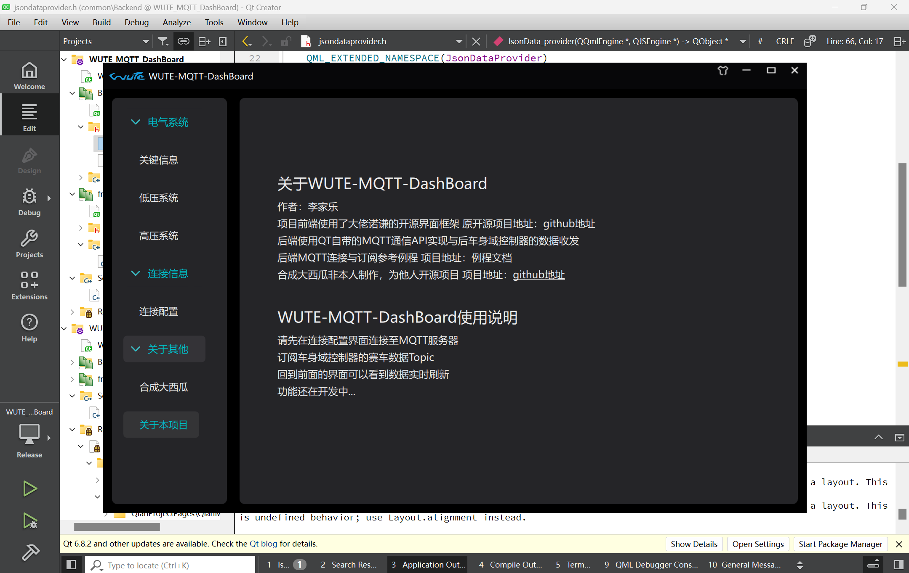

需配合MQTT服务器使用，本项目MQTT服务器是基于华为云IoTDA搭建的

上位机前端基于<诺谦>的开源界面框架开发，[github地址](https://github.com/nuoqian-lgtm/QianWindow)(👈戳我了解)

后端MQTT连接至服务器、topic订阅与发布功能基于QT自带的MQTT API开发实现

前后端通信部分数传数据采用数据模型和后端注册的方式实现

### MQTT数传协议架构

采用MQTT的json数据格式

json测试数据包：

```

{
  "ActButtonState":1,"ILValue":1345,
  "ReadyButtonState":1,"McuReadyState":0,"DriveReadyState":1,

  "LvBatsV":27,"LvBatsI":23,"LvBatsT":62,

  "VcuState":1,"BmsState":1,"McuState":1,
  "BduState":1,"BspdState":1,"TsalrState":1,
  "PumpState":1,"Fan1State":1,"Fan2State":1,
  "TaillightState":1,"BuzzerState":1,"DrsState":1,

  "VcuValue":102,"BmsValue":10,"McuValue":40,
  "BduValue":40,"BspdValue":40,"TsalrValue":40,
  "PumpValue":40,"Fan1Value":40,"Fan2Value":40,
  "TaillightValue":40,"BuzzerValue":40,"DrsValue":40,

  "AccuV":40,"AccuI":40,"AccuTcmax":40,"AccudVmax":40,
  "McuT":40,
  "MotorRpm":40,"MotorTorque":40,"MotorTemp":40
  }

```

---

# 使用说明

## WUTE-MQTT-DashBoard上位机使用说明

请先在<连接配置>界面连接上位机至MQTT服务器

订阅车身域控制器的赛车数据相关Topic

回到<车况信息>下的<关键信息><低压系统><高压系统>界面即可看到相关数据的实时刷新显示

## 无线烧录使用说明

请先配置S32K344对ESP32S3电源使能引脚，使ESP32S3调试芯片正常供电

运行../Firmware/ESP32S3_Firmware/flash_download_tool_3.9.5_0烧录软件，连接RBCM核心板的USB烧录接口与电脑，烧录../Firmware/ESP32S3_Firmware/DAP_HS_ESP_20231027.bin到ESP32S3中

制作ESP32S3小板，连接在电脑上用于与RBCM核心板上的ESP32S3建立远程连接

> 烧录流程同上

配置通信信道和烧录模式，建立无线连接

配置COM口，烧录标定


施工中。。。
